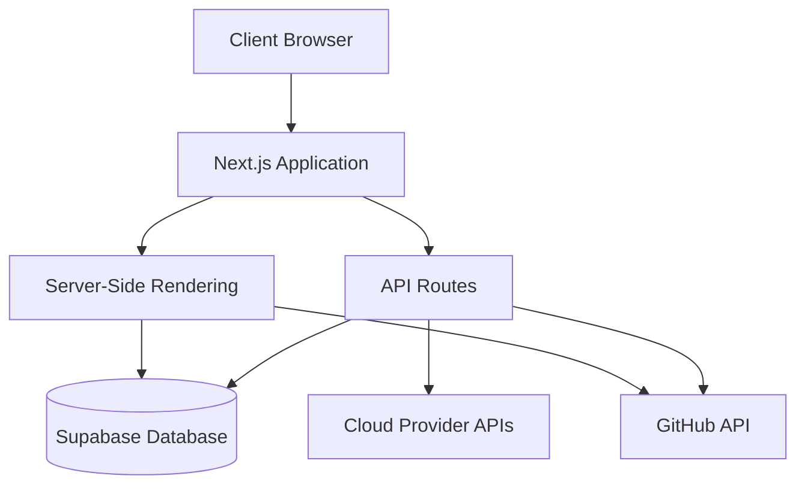
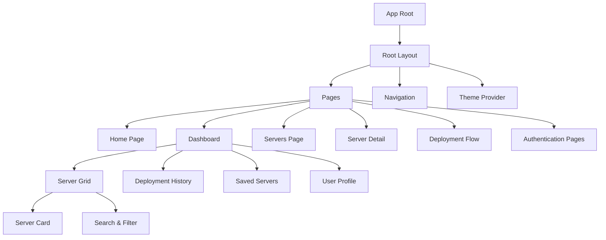
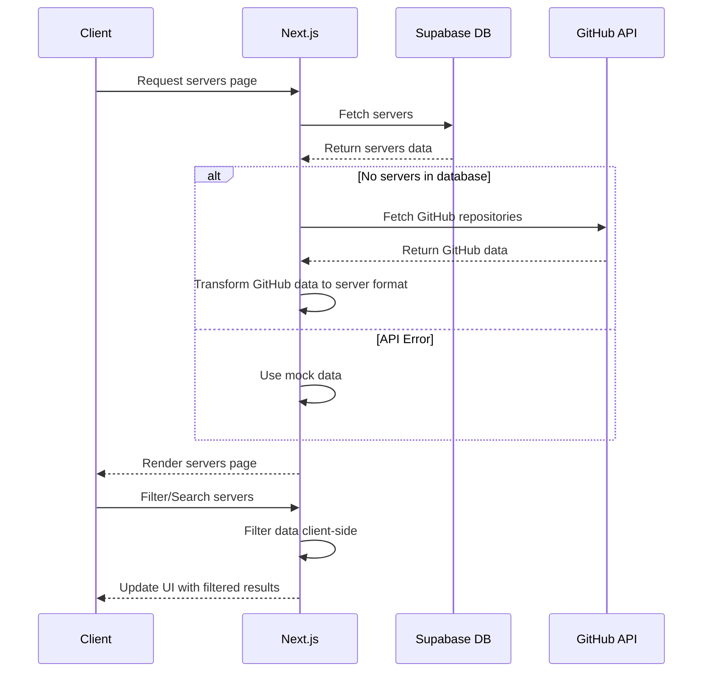
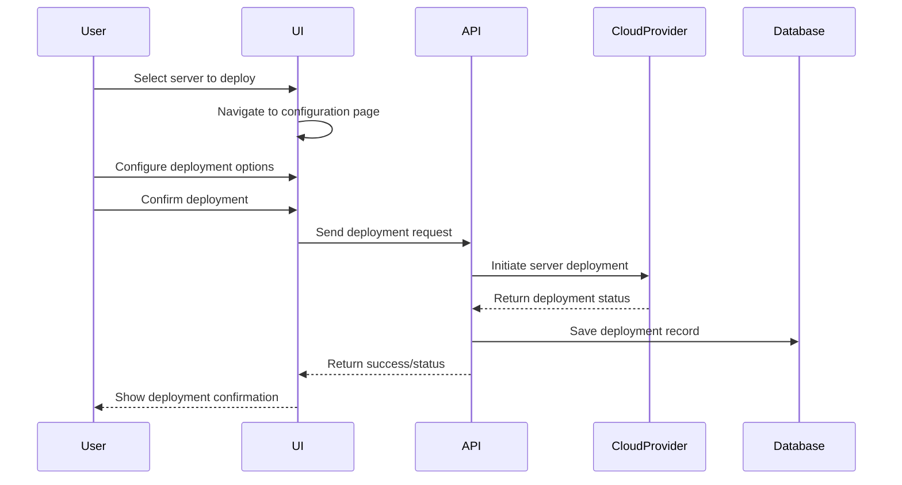
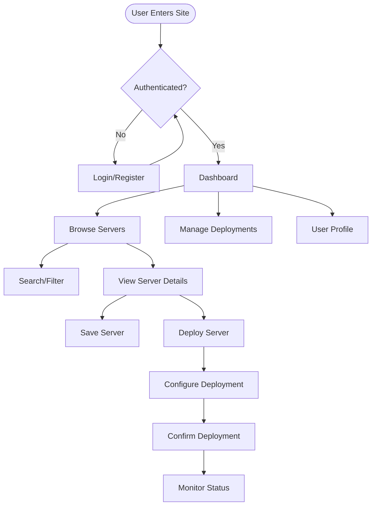
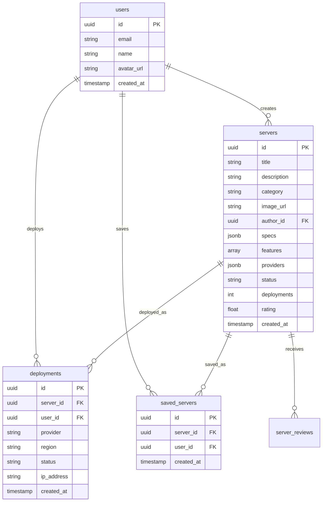
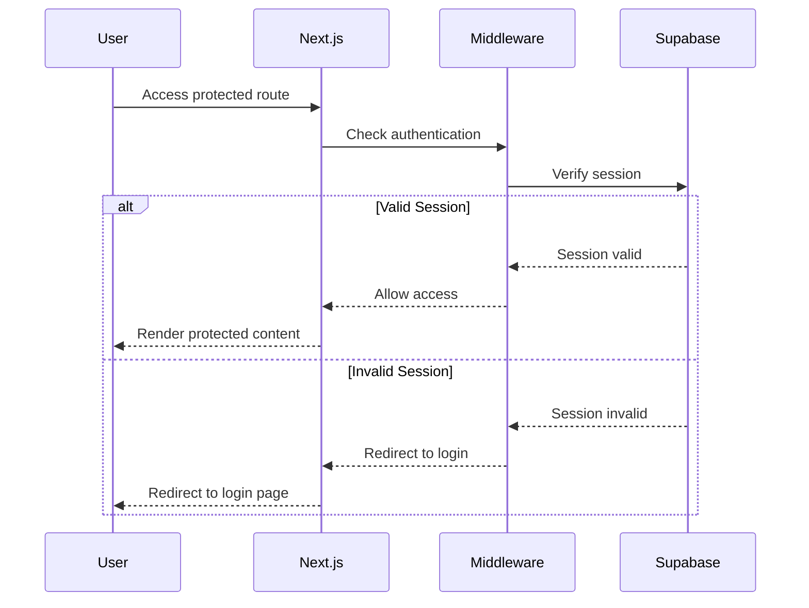
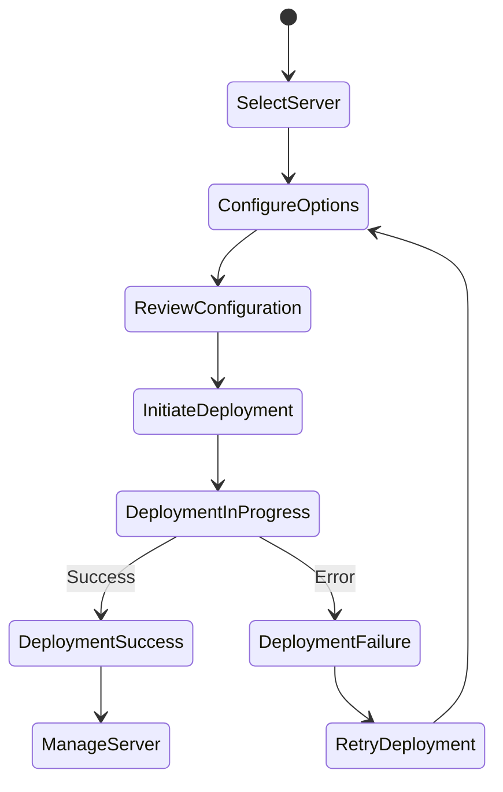

# MCPMarket Codebase Analysis

## Table of Contents

1. [Introduction](#introduction)
2. [Architecture Overview](#architecture-overview)
3. [Technology Stack](#technology-stack)
4. [Key Components](#key-components)
5. [Data Flow](#data-flow)
6. [User Experience](#user-experience)
7. [Development Patterns](#development-patterns)
8. [Database Schema](#database-schema)
9. [API Structure](#api-structure)
10. [Authentication & Authorization](#authentication--authorization)
11. [Deployment Process](#deployment-process)
12. [Error Handling](#error-handling)
13. [Future Improvements](#future-improvements)
14. [Conclusion](#conclusion)

## Introduction

MCPMarket is a modern web application designed to serve as a marketplace for Model Content Protocol (MCP) servers. It allows users to discover, deploy, and manage MCP servers with one-click deployment functionality across multiple cloud providers. The platform is built with Next.js 15 and Supabase, providing a sleek, intuitive interface with features like search, filtering, and categorization of servers.

This document analyzes the codebase from three perspectives:

1. **Software Architect**: Examining the overall structure, patterns, and technical decisions
2. **Software Developer**: Focusing on code quality, implementation details, and development practices
3. **Product Manager**: Evaluating features, user experience, and potential improvements

## Architecture Overview

### High-Level Architecture



The application follows a modern web architecture with Next.js as the core framework, utilizing both server-side rendering and client-side components. The backend is primarily powered by Supabase, with additional integrations to GitHub and various cloud provider APIs.

### Component Architecture



The component architecture follows a hierarchical structure with clear separation of concerns. The application is organized into pages and reusable components, with client-side wrappers handling interactive elements.

## Technology Stack

### Core Technologies

- **Frontend Framework**: Next.js 14.2.23 (App Router)
- **UI Framework**: React 18
- **Database & Authentication**: Supabase
- **Styling**: Tailwind CSS
- **Component Library**: Custom components with Radix UI primitives
- **Animation**: Framer Motion
- **Icons**: Lucide React
- **Form Handling**: React Hook Form

### Development Tools

- **TypeScript**: For type safety
- **Tempo DevTools**: For development environment
- **Prettier**: For code formatting

## Key Components

### Server-Related Components

1. **ServerGrid**: Displays a grid of server cards with optional search and filtering
2. **ServerCard**: Individual server display with details and action buttons
3. **ServersClientWrapper**: Client-side wrapper for server listing with search and filter functionality

### UI Components

1. **Hero**: Landing page hero section with animated elements
2. **Navbar/NavbarClient**: Navigation components for authenticated and unauthenticated users
3. **SearchFilter**: Reusable search and filter component
4. **Dashboard components**: Various dashboard-specific components

### Data Hooks

1. **useServers**: Custom hook for fetching and managing server data
2. **useDeployments**: Hook for deployment-related operations
3. **useSavedServers**: Hook for managing saved servers

## Data Flow

### Server Data Flow



### Deployment Flow



## User Experience

### User Flows



The user experience is designed around a central dashboard with intuitive navigation to different sections. The server browsing experience includes search and filtering capabilities, while the deployment process is streamlined with a step-by-step configuration flow.

### UI Components and Styling

The application uses a consistent design system with:

- A clean, modern aesthetic with a dark mode option
- Card-based layouts for server browsing
- Tab-based navigation in the dashboard
- Responsive design for all device sizes
- Subtle animations for enhanced user experience

## Development Patterns

### Client-Server Pattern

The application follows a hybrid rendering approach:

1. **Server Components**: Used for data fetching and initial rendering
2. **Client Components**: Used for interactive elements with "use client" directive

### Data Fetching Patterns

```mermaid
flowchart TD
    A[Data Fetching Approaches] --> B[Server-Side]  
    A --> C[Client-Side]
    
    B --> D[getServers Function]
    B --> E[Supabase Server Client]
    
    C --> F[Custom Hooks]
    C --> G[API Routes]
    
    F --> H[useServers]
    F --> I[useDeployments]
    F --> J[useSavedServers]
    
    G --> K[/api/servers]
    G --> L[/api/deployments]
    G --> M[/api/github/servers]
```

The application uses multiple data fetching patterns:

1. **Server-Side Rendering**: For initial page loads with data requirements
2. **Client-Side Fetching**: For interactive components and real-time updates
3. **Custom Hooks**: Encapsulating data fetching and state management logic
4. **API Routes**: For client-side data fetching and third-party API integration

### Error Handling

The application implements several error handling strategies:

1. **Fallback Data**: Using mock data when API calls fail
2. **Try-Catch Blocks**: Around API calls and data processing
3. **Loading States**: Showing skeletons during data loading
4. **Error States**: Displaying user-friendly error messages

## Database Schema

### Core Tables



The database schema is designed around core entities: users, servers, deployments, and saved servers. The schema uses PostgreSQL features like JSONB for flexible data structures and array types for simple lists.

## API Structure

### API Endpoints

```mermaid
flowchart LR
    API[API Routes] --> Servers[/api/servers]
    API --> Deployments[/api/deployments]
    API --> GitHub[/api/github]
    API --> User[/api/user]
    API --> CloudProviders[/api/cloud-providers]
    API --> SavedServers[/api/saved-servers]
    API --> Notifications[/api/notifications]
    
    Servers --> ServerById[/api/servers/[id]]
    Servers --> ServerSync[/api/servers/sync]
    
    Deployments --> DeploymentById[/api/deployments/[id]]
    
    GitHub --> GitHubServers[/api/github/servers]
    GitHub --> GitHubReadme[/api/github/readme]
    GitHub --> GitHubImport[/api/github/import]
```

The API structure follows RESTful conventions with resource-based endpoints. The API routes handle both internal data operations and external integrations with services like GitHub.

## Authentication & Authorization

### Authentication Flow



The application uses Supabase for authentication with middleware to protect routes. The authentication flow includes sign-in, sign-up, and password reset functionality.

### Authorization

Authorization is implemented through:

1. **Row-Level Security (RLS)**: In Supabase for data access control
2. **Client-Side Checks**: For UI element visibility
3. **API Route Protection**: Using middleware

## Deployment Process

### Server Deployment Flow



The deployment process is designed to be user-friendly with clear steps and status updates. The system integrates with multiple cloud providers to offer deployment flexibility.

## Error Handling

### Current Implementation

The application implements several error handling strategies:

1. **API Error Handling**: Try-catch blocks around API calls with fallback to mock data
2. **UI Error States**: Conditional rendering for error messages
3. **Type Safety**: TypeScript for compile-time error prevention

### Areas for Improvement

Some areas where error handling could be enhanced:

1. **Consistent Error Boundaries**: Implementing React Error Boundaries for component-level error handling
2. **Centralized Error Logging**: Adding a centralized error logging system
3. **More Graceful Fallbacks**: Enhancing the fallback UI for different error scenarios

## Future Improvements

### Technical Improvements

1. **Performance Optimization**: Implementing more efficient data fetching and caching strategies
2. **Enhanced Type Safety**: Strengthening TypeScript usage throughout the codebase
3. **Testing Coverage**: Adding comprehensive unit and integration tests
4. **Monitoring & Analytics**: Implementing application monitoring and usage analytics

### Feature Enhancements

1. **Real-time Updates**: Adding WebSocket connections for live deployment status updates
2. **Advanced Filtering**: Enhancing search and filter capabilities
3. **User Collaboration**: Adding team-based access and collaboration features
4. **Integration Ecosystem**: Expanding the range of integrations with cloud providers and tools

## Conclusion

The MCPMarket codebase represents a well-structured modern web application built with Next.js and Supabase. It follows good architectural patterns with clear separation of concerns and reusable components. The application provides a solid foundation for a marketplace platform with server discovery, deployment, and management capabilities.

From a software architecture perspective, the application demonstrates good practices in terms of component organization and data flow. From a developer's perspective, the code is generally clean and maintainable, though there are opportunities for enhanced error handling and testing. From a product management perspective, the application delivers core marketplace functionality with a user-friendly interface, with clear paths for future feature enhancements.

The main areas for improvement include strengthening error handling, expanding test coverage, and enhancing real-time capabilities for a more dynamic user experience.
